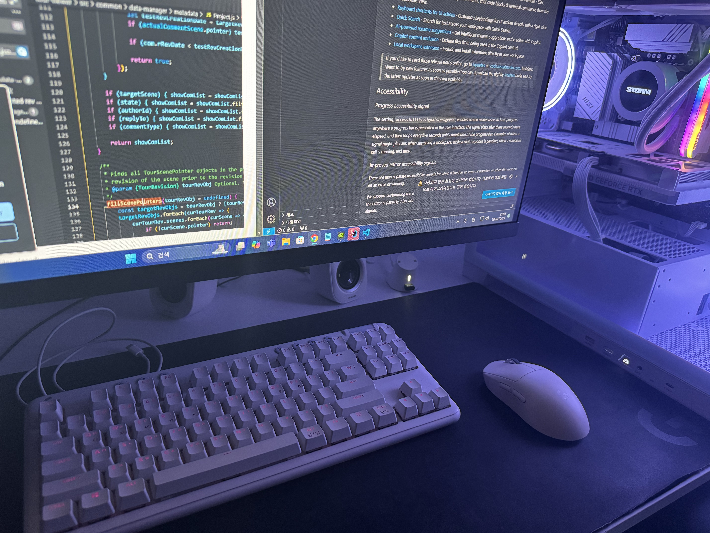

# KIM SUNMIN 👋

풀스택 엔지니어를 목표로 공부 중입니다.  
React 중심으로 웹 개발 역량을 키우고 있으며, 매일 학습 기록을 남기고 있습니다.

📌 **목표: 프론트엔드 기반 풀스택 엔지니어로 성장**

---

## 🎓 Background
- 일본에서의 생활 및 근무 경험을 통해 다양한 환경에서의 적응력을 쌓음
- 현재 프로그래머스 국비지원 교육과정을 통해 웹 개발 전반을 학습 중

---

## 🧩 Tech Stack

 

---

## 🚀 Portfolio

- 포트폴리오 사이트: 준비 중

---

## 📚 TIL (Today I Learned)

---

## ✍️ Study Notes

---

## ✍️ Blog
- Velog: 준비 중

---

## 📩 Contact

---

